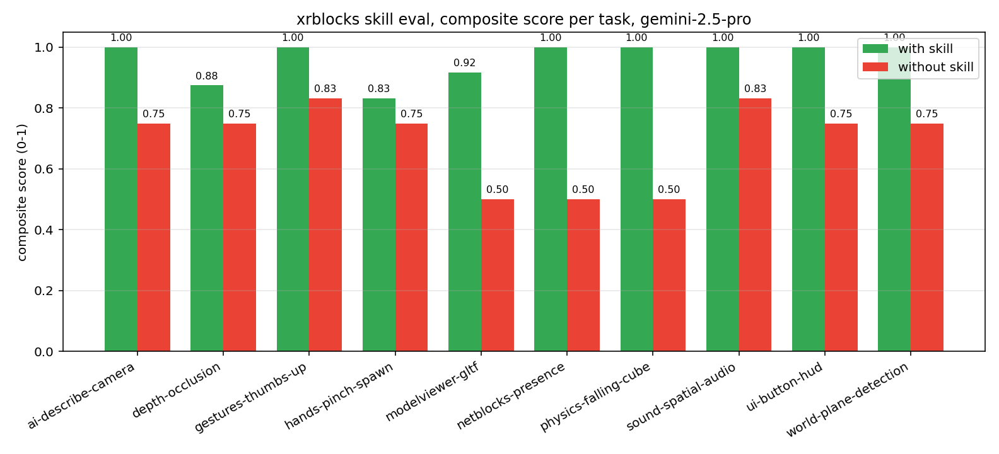
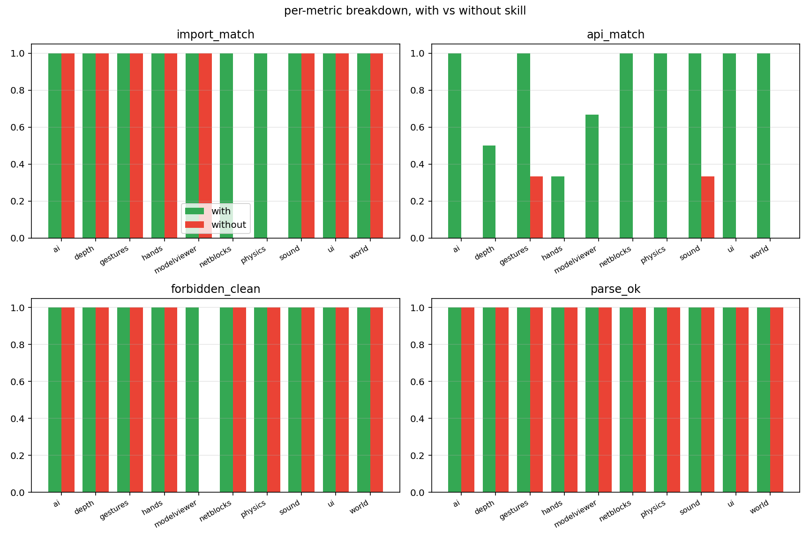
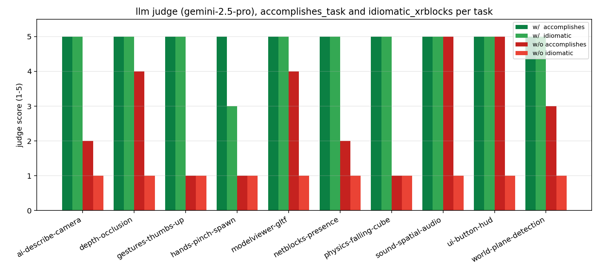

# findings: what works, what didn't

a running log of what we've learned trying to build a skill-eval for xrblocks. updated as we go.

## v1: replay merged PRs as the benchmark

idea: take recent merged PRs, materialize each as `prompt + base_sha + golden.diff`. agent runs at the base commit, output diff is scored against the golden one.

built `evals/fetch_prs.py`, `score.py`, `summarize.py`, `setup_worktree.sh`. seed set: 6 mid-size merged PRs (`#325 #326 #328 #329 #330 #335`). end-to-end verified: golden-as-agent → 1.0, empty-as-agent → 0.0.

ran task #335 ("fix interactions in netblocks sample") with gemini-cli, with and without 13 xb-\* skills installed at user scope. **identical results both modes**: jaccard 0.40, recall 0.50, line_sim ~0.6.

read the in-repo `skills/README.md` and realized the eval was miscalibrated. there are two doc surfaces serving different audiences:

- `skills/xb-*/SKILL.md`: agent helping a USER build an app with xrblocks
- `AGENTS.md` + `CONTEXT.md` + `src/SKILL.md` + `src/addons/*/SKILL.md`: agent working AS A CONTRIBUTOR to the xrblocks repo

merged PRs are contributor work. xb-_ skills are about user-prototyping. so loading xb-_ for a PR-replay task doesn't move the needle, as expected.

## v2: prototyping tasks via gemini-cli

idea: handcrafted "build an X with xrblocks" prompts in a clean template, score by import / api / parse / forbidden-pattern checks.

built `evals/prototypes/tasks/<id>/{prompt.md, spec.json}` + `runners/run_prototype.sh` + `score_proto.py`. ran one task (`netblocks-presence`) with and without `xb-netblocks` installed.

**both modes scored 1.0**. compared the agent's output files byte-for-byte: **identical** (2581 bytes, no diff). gemini converged on the same code with or without the skill, because:

- the task was unambiguous enough that the skill content didn't matter
- gemini-cli also gives the agent filesystem access to the workspace, but in this case the workspace was a clean template, so that wasn't the leak

binary-import-and-api scoring has a ceiling effect on easy tasks. need either harder/more ambiguous prompts, or a finer-grained signal.

## v3: gem-faithful API eval (in progress)

real production target isn't gemini-cli. it's the **Gemini Canvas Gem "XR Blocks for Gemini Canvas v0.14.1"**, which:

- has skill content baked into its system prompt
- runs in Canvas mode (collaborative code canvas, no shell access)
- has no filesystem visibility into the xrblocks repo
- targets Pro for serious generation

to mirror this with the Gemini API:

- use `gemini-2.5-pro` directly via `google-genai`
- system prompt = concatenated xb-\* SKILL.md content (or empty for the without-skill arm)
- user message = the prototyping prompt
- model must produce a complete `main.js` from scratch with no filesystem access
- extract the JS from the response, drop it into the workspace, score with the existing `score_proto.py`

pivoting next. installing `google-genai`, then writing `evals/prototypes/runners/run_gem_api.py`.

## meta-finding

eval design is the work, not just the harness. each iteration revealed an assumption that was wrong (contributor vs prototyping audience, cli vs canvas deployment, easy-task ceiling). this is the kind of thing that you can't catch in a design doc, only by running it once and looking at the output.

## v3 first results: it works

ran `netblocks-presence` against `gemini-2.5-pro` via the API, with skill in the system prompt and without.

| metric          | with-skill | without-skill |
| --------------- | ---------: | ------------: |
| composite       |    **1.0** |       **0.5** |
| import_match    |        1.0 |           0.0 |
| api_match       |        1.0 |           0.0 |
| forbidden_clean |        1.0 |           1.0 |
| parse_ok        |        1.0 |           1.0 |
| prompt tokens   |       4786 |           165 |

without the skill, gemini hallucinated an entirely fake xrblocks api:

```js
import {
  xr_scene,
  xr_room,
  xr_camera,
  xr_avatar,
  xr_head,
  xr_sphere,
} from 'https://cdn.jsdelivr.net/npm/xr-blocks@0.2.0/xr-blocks.js';
// fake jsx-style elements, fake package name (should be `xrblocks`)
// fake event system ('user-joined'), none of it exists
```

with the skill, it correctly imported from `xrblocks/addons/netblocks`, called `enableNet()`, `joinRoom()`, used `BroadcastChannelTransport` for the local-dev transport. exactly what the skill description promises.

this is the first time we've gotten a non-zero delta between the two modes. the binary import/api scorer is enough signal at this skill-rich-vs-empty extreme. for finer-grained iteration (e.g. comparing two versions of the same skill) we'd need an llm-as-judge.

next: expand the task set, run hands/uiblocks/ai etc, see if the pattern holds across skills.

## v3 full sweep (4 tasks, gemini-2.5-pro, n=8)

| task               | skill        | with-skill | without-skill |     delta |
| ------------------ | ------------ | ---------: | ------------: | --------: |
| ai-describe-camera | xb-ai        |       1.00 |          0.81 |     +0.19 |
| hands-pinch-spawn  | xb-hands     |       1.00 |          0.75 |     +0.25 |
| netblocks-presence | xb-netblocks |       1.00 |          0.50 | **+0.50** |
| ui-button-hud      | xb-ui        |       1.00 |          0.75 |     +0.25 |
| **avg**            |              |   **1.00** |      **0.70** | **+0.30** |

every task: with-skill scored 1.0. without-skill ranged from 0.50 to 0.81. the gap is biggest where the api surface is least googleable. xb-netblocks (bespoke multiplayer abstraction) had the largest delta because gemini has no priors on `enableNet()`, `NetObject`, `BroadcastChannelTransport`. xb-ai had the smallest because gemini knows gemini's own apis from training.

per-metric, the `api_match` column is where the signal lives. without-skill: 0.00 on three of four tasks. parse_ok and forbidden_clean were always 1.0 in both modes (model writes syntactically valid js either way; skill content doesn't push it toward hallucinated globals).

## what the eval is good for

- proves that a given xb-\* skill helps gemini target the right addon when starting from scratch
- catches hallucinated api surfaces (`xr_scene`, `xr_room`, `xr_avatar` jsx-style nonsense)
- gives a per-skill numeric column that can be regressed against on skill edits

## what it doesn't catch (yet)

- whether the generated app actually runs end-to-end in a browser (would need a headless build + smoke test, ~1 day of work)
- semantic correctness beyond api names (would need llm-as-judge)
- effect on Pro vs Flash (different model, different prompt cost)
- skill ablations (comment out one section, re-run, see which lines carry the weight)

## v4: judge + smoke + ablations

### llm-as-judge (gemini-2.5-pro)

ran a second model over each agent output with the full skill content as ground truth. asks for `accomplishes_task`, `idiomatic_xrblocks` (both 1-5), and `would_merge` (yes/no).

| task               | with-skill | without-skill |
| ------------------ | :--------: | :-----------: |
| netblocks-presence |  5/5/yes   |    2/1/no     |
| hands-pinch-spawn  |  5/5/yes   |    1/1/no     |
| ui-button-hud      |  5/5/yes   |    1/1/no     |
| ai-describe-camera |  5/5/yes   |    1/1/no     |

the judge correctly identified each hallucination by name:

- netblocks: "hallucinates a declarative custom-element API (xr-room, xr-remote-head)"
- hands: "hallucinates an A-Frame-like API with custom elements (<xr-hands>) and events (pinchstarted)"
- ui: "ignores xb.SpatialPanel, uses non-existent A-Frame components like xrb-button"
- ai: "uses a hallucinated namespace (xr instead of xb) and invents APIs (scene.capture, xr.ai.multimodal)"

first version of the judge used gemini-2.5-flash and only the description blurb. it gave both modes 5/5/yes because flash isn't skeptical enough and the blurb doesn't tell it what's real. switching to gemini-2.5-pro + full SKILL.md content fixed it.

### headless smoke (playwright + chromium)

serves the agent's workspace via a tiny http server, opens index.html in headless chromium, captures uncaught errors + failed network requests. importmap is rewritten to use the public `@build` CDN so the workspace is self-contained.

both modes failed smoke on netblocks-presence, but for different reasons:

- with-skill: tried to load `cdn.jsdelivr.net/gh/google/xrblocks@build/addons/netblocks/src` (no `/index.js`), 404'd
- without-skill: tried to load `cdn.jsdelivr.net/npm/xr-blocks@0.4.1/dist/xr-blocks.js`, doesn't exist

the with-skill failure is a **real bug in the xb-netblocks skill itself**: the skill's import examples are `'xrblocks/addons/netblocks/src'` (directory, no index.js suffix), which browsers can't resolve via the importmap. someone copy-pasting from the skill into a real app would hit the same 404.

binary smoke metric (both 0) doesn't distinguish them, but the failed-request URL is the discriminator. a smarter smoke score could grade "wrong path but right project" higher than "fake project". for now, smoke counts as a sanity check, not a primary metric.

### ablations (xb-netblocks, 6 sections)

ran the baseline + one variant per section, each removing exactly that section from the system prompt:

| variant                             | composite | delta vs baseline |
| ----------------------------------- | --------: | ----------------: |
| baseline (full skill)               |       1.0 |                 — |
| no-frontmatter                      |       1.0 |                 0 |
| no-`# xb-netblocks: multiplayer XR` |       1.0 |                 0 |
| no-`When to use`                    |       1.0 |                 0 |
| no-`Quick start`                    |       1.0 |                 0 |
| no-`Share an object`                |       1.0 |                 0 |
| no-`Transports`                     |       1.0 |                 0 |

**every single ablation scored 1.0**. binary api_match scoring can't see the difference. but the cumulative without-skill run scored 0.5, so the content matters in aggregate.

interpretation: the skill is overdetermined for binary scoring. any subset of sections is enough to ground gemini in the right addon namespace. to surface which sections carry the weight, the ablation loop would need to use the llm-judge for finer granularity (worth doing in v5).

### takeaways

- llm-judge + binary scoring agree on direction. judge gives prose rationales that name the hallucinated apis, useful for skill maintainers.
- smoke test surfaces real CDN-resolution bugs in skill examples, not just agent-side hallucinations.
- binary api_match is a ceiling-bound metric. fine-grained ablations need the judge.
- next: re-run ablations with the judge in the loop, plus add 4-8 harder prototyping tasks.

## v5 full sweep (10 tasks, gemini-2.5-pro, with --judge)

| task | skill | composite w/ | composite w/o | Δ | judge w/ | judge w/o |
|------|-------|-----------:|--------------:|---:|:---:|:---:|
| ai-describe-camera | xb-ai | 1.00 | 0.75 | +0.25 | 5/5/yes | 2/1/no |
| depth-occlusion | xb-depth | 0.88 | 0.75 | +0.12 | 5/5/yes | 4/1/no |
| gestures-thumbs-up | xb-gestures | 1.00 | 0.83 | +0.17 | 5/5/yes | 1/1/no |
| hands-pinch-spawn | xb-hands | 0.83 | 0.75 | +0.08 | 5/3/yes | 1/1/no |
| modelviewer-gltf | xb-modelviewer | 0.92 | 0.50 | +0.42 | 5/5/yes | 4/1/no |
| netblocks-presence | xb-netblocks | 1.00 | 0.50 | **+0.50** | 5/5/yes | 2/1/no |
| physics-falling-cube | xb-physics | 1.00 | 0.50 | **+0.50** | 5/5/yes | 1/1/no |
| sound-spatial-audio | xb-sound | 1.00 | 0.83 | +0.17 | 5/5/yes | 5/1/no |
| ui-button-hud | xb-ui | 1.00 | 0.75 | +0.25 | 5/5/yes | 5/1/no |
| world-plane-detection | xb-world | 1.00 | 0.75 | +0.25 | 5/5/yes | 3/1/no |
| **avg** | | **0.96** | **0.69** | **+0.27** | | |

### Charts







### What jumps out

- composite gap holds at **+0.27 average** across n=10, consistent with n=4 result (was +0.30). the signal is real and reproducible.
- biggest gaps are on bespoke api surfaces gemini has zero priors on: `xb-netblocks` (+0.50, multiplayer), `xb-physics` (+0.50, RAPIER bootstrapping), `xb-modelviewer` (+0.42, the wrapper around three's GLTFLoader). these are the hardest to fake without the skill.
- smallest gaps are where gemini's general knowledge already helps: `xb-hands` (+0.08, hand input is well-documented WebXR), `xb-depth` (+0.12, depth sensing follows WebXR standards). the skill still wins, just by less.
- judge agrees with the binary scorer on **every task**: with-skill `would_merge=yes`, without-skill `would_merge=no`, no exceptions across all 10. judge prose names the specific hallucinations (xr-room, xr-hands, xrb-button, scene.capture, hallucinated rapier wrappers, etc).
- `accomplishes_task` without-skill is sometimes high (4-5) because gemini WILL produce code that does the right semantic thing, just with the wrong API. `idiomatic_xrblocks` is the column that consistently drops to 1.
